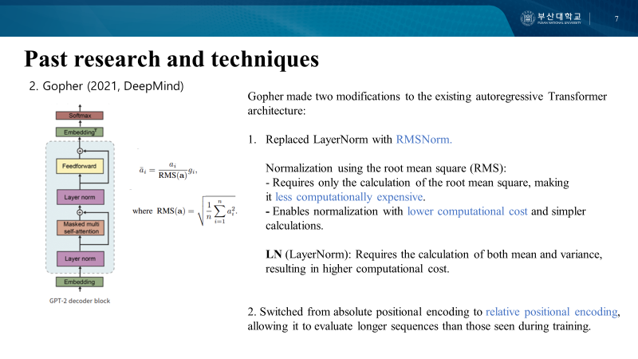
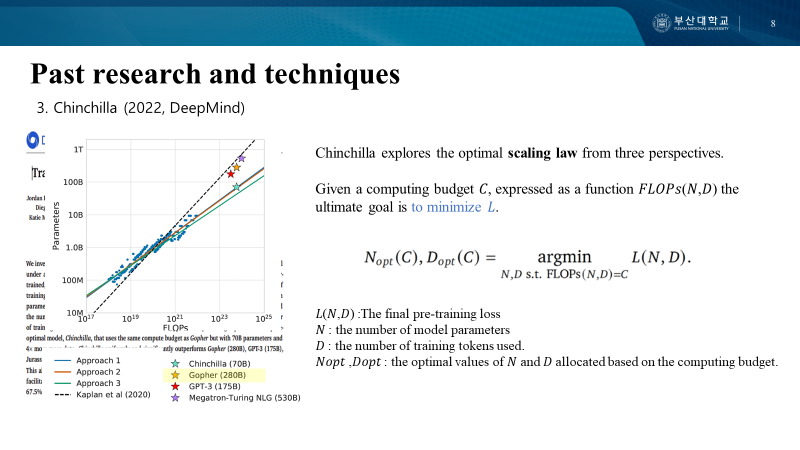

# Motivation Behind Scientific Large Language Models

## Overview

This repository contains a presentation on the motivation behind scientific large language models, focusing on the background that led to Galactica and the development of prior large language models.

The presentation explains why scientific knowledge management became an important problem, why traditional search engines have limitations in scientific research, and how large language models can support knowledge organization, synthesis, and reasoning.

## Motivation

Scientific information is rapidly increasing, making it difficult for individual researchers to manually read, organize, and connect large amounts of literature.

Traditional search engines provide access to documents, but they still require humans to search, filter, interpret, and synthesize information. This creates a bottleneck in scientific research.

Scientific large language models aim to address this problem by learning from large-scale scientific corpora and generating useful secondary content such as explanations, summaries, and structured knowledge.

## Topics Covered

- Background of scientific information overload
- Limitations of search engines for scientific knowledge access
- Motivation behind Galactica
- Review of prior large language models
  - GPT-3
  - Gopher
    
  - Chinchilla
    
  - OPT
  - PaLM
- Key technical ideas in LLM development
  - Few-shot and zero-shot learning
  - Scaling laws
  - Compute-optimal training
  - Model architecture improvements
  - Data quality and training corpus design

## Key Takeaways

Through this presentation, I studied how large language models evolved before Galactica and why scientific domains require specialized language models.

The main takeaway is that LLM development is not only about increasing model size. Training data quality, compute efficiency, model architecture, and domain-specific knowledge are also important factors for building useful language models.

In particular, Galactica shows how language models can be extended from general text generation to scientific knowledge processing.

## File

- [Presentation PDF](./seminar_motivationForGlatica.pdf)
  Presentation slides on the motivation behind scientific LLMs and prior LLM research.

## Keywords

`Large Language Model` `Scientific LLM` `Galactica` `GPT-3` `Gopher` `Chinchilla` `OPT` `PaLM` `NLP` `Paper Review`

## Author

Jiwon Lee  
Pusan National University  
Machine Learning & Bioinformatics Lab
email: jiwon_lee@pusan.ac.kr
